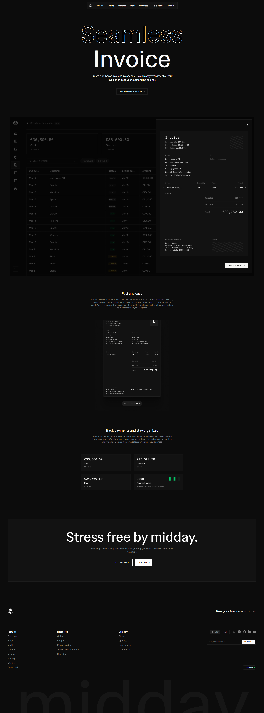

# illumi




Billing and operations platform that combines marketing pages, authenticated workspaces, and API-driven workflows in one deployable app.

## Snapshot
- **Core value:** reduce manual invoicing/admin overhead with workflow automation.
- **Architecture:** route-grouped Next.js app with a clean split between public and dashboard surfaces.
- **Integrations:** Supabase, Stripe, Resend, and S3-backed document/media handling.

## What it does
- Public marketing and conversion pages with product documentation.
- Authenticated dashboard experience for logged-in users.
- API route layer for product operations and integrations.
- Payment and email integration surfaces (`stripe`, `resend`) with Supabase-backed data flows.

## Stack
- Next.js 16 + React 19 + TypeScript
- Supabase (SSR + client SDK), Postgres (`pg`)
- Stripe, Resend, AWS S3 SDK
- TanStack Query, Radix UI, TipTap, Ant Design

## Local development
```bash
npm install
npm run dev
```

The app runs on `http://localhost:3001`.

Build/start:
```bash
npm run build
npm run start
```

## Repository structure
- `src/app/(marketing)` and `src/app/(dashboard)` route groups
- `src/app/api/` API handlers
- `src/components/` UI and feature components
- `scripts/` build and deployment helpers
- `supabase/` database-related assets

## Practical next improvements
- Add contract tests for API routes touching payments/storage.
- Add database migration runbook for safer production rollouts.
- Add dashboard latency profiling on high-traffic pages.
